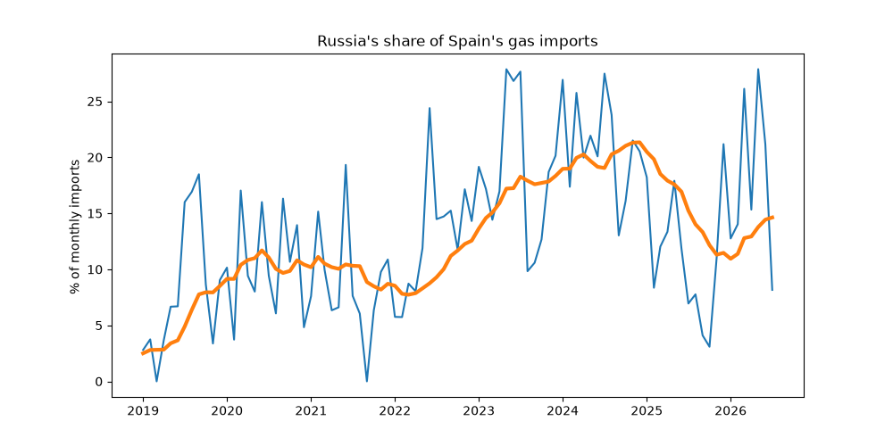

# Spain's Russian gas dependence

This project shows Spain's imports of natural gas from Russia, and how they change as the EU law (Regulation (EU) 2026/261), adopted on 26 January 2026, phases out all imports of Russian gas, both pipeline gas and liquefied natural gas (LNG).

Russia was Spain's third-largest gas supplier in 2025, behind Algeria and the United States. In May 2026, weeks after the EU banned short-term contracts for Russian LNG, it still supplied 27.9% of Spain's gas imports. All Russian LNG imports are banned from 1 January 2027, so Spain has a few months to replace this supply.

Gas contracts are usually agreed years in advance, so the law is staged to phase out these contracts over a transition period, to limit the effect on prices and markets.

The bans are as follows:
- 25 April 2026 - Russian LNG under short-term contracts
- 17 June 2026 - Russian pipeline gas under short-term contracts
- 1 January 2027 - All Russian LNG
- Autumn 2027 - All Russian pipeline gas

Russia has no direct pipeline to Spain, so virtually all of Spain's Russian gas (over 99.9% since 2004) arrives by ship as LNG. This makes the 1 January 2027 ban the key date for Spain.

