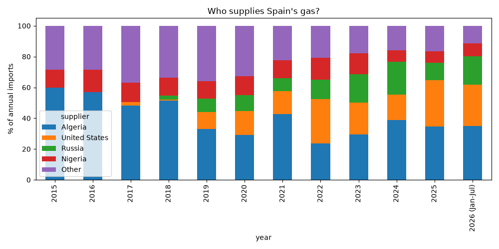

# Spain's Russian gas dependence

This project shows Spain's imports of natural gas from Russia, and how they change as the EU law (Regulation (EU) 2026/261), adopted on 26 January 2026, phases out all imports of Russian gas, both pipeline gas and liquefied natural gas (LNG).

Russia was Spain's third-largest gas supplier in 2025, behind Algeria and the United States. In May 2026, weeks after the EU banned short-term contracts for Russian LNG, it still supplied 27.9% of Spain's gas imports. All Russian LNG imports are banned from 1 January 2027, so Spain has a few months to replace this supply.

Gas contracts are usually agreed years in advance, so the law is staged to phase out these contracts over a transition period, to limit the effect on prices and markets.

The bans are as follows:
- 25 April 2026 - Russian LNG under short-term contracts
- 17 June 2026 - Russian pipeline gas under short-term contracts
- 1 January 2027 - All Russian LNG
- Autumn 2027 - All Russian pipeline gas

Russia has no direct pipeline to Spain, so virtually all of Spain's Russian gas (over 99.9% since 2004) arrives by ship as LNG. This makes the 1 January 2027 ban the key date for Spain.


## Who supplies Spain's gas?



Algeria is Spain's largest supplier, sending about 128,500 GWh in 2025. The United States is second, and its volumes swing sharply from year to year: about 56,900 GWh in 2024 and 111,700 GWh in 2025.

Apart from a small amount in 2004, Spain imported no gas from Russia until 2018. Its share then grew to a peak of 21.3% in 2024, when it was Spain's second-largest supplier, ahead of the US. It fell to 11.5% in 2025 and was back to 18.3% over the first seven months of 2026.

Nigeria has moved the other way, from about 63,800 GWh in 2022 to 27,200 GWh in 2025.

## Data

The data comes from CORES, the Spanish public body that manages strategic fuel reserves. It publishes monthly natural gas imports by country of origin, from 2004 onwards, measured in GWh.

I checked the cleaned data against three published figures:

- Total imports for 2023 come to 396,434 GWh, matching the annual balance published by CORES (277,078 GWh LNG plus 119,356 GWh pipeline).
- Russian LNG for July 2026 is 2,087.5 GWh, against 2,088 GWh reported by the grid operator Enagás.
- Russia's share in May 2026 is 27.9%, against 27.8% reported by Enagás.

## How to run it

```bash
git clone https://github.com/joelucadooley/spain-russian-gas.git
cd spain-russian-gas
python3 -m venv .venv
source .venv/bin/activate
pip install -r requirements.txt
wget -P data/raw https://www.cores.es/sites/default/files/archivos/estadisticas/importaciones-gas.xlsx
python src/clean.py
python src/analysis.py
python src/suppliers.py
```

`clean.py` reads the CORES spreadsheet, removes totals and subtotals, and saves a tidy table to a SQLite database. `analysis.py` calculates Russia's share of imports and draws the first chart. `suppliers.py` calculates each supplier's share by year and draws the second.

## Limitations

- Monthly figures jump around because LNG arrives by the shipload. The 12-month average is a better guide to the trend.
- The data ends in July 2026, so it is too early to say whether the fall after May will last, and the 2026 figures cover January to July only.
- The charts show timing, not cause. Prices, contracts and events elsewhere also affect how much gas Spain buys from each country.
- Imports are not the same as consumption. Spain re-exports part of the gas it imports (about 75,000 GWh in 2023, according to CORES).

## Sources

- CORES gas import statistics: https://www.cores.es/es/estadisticas
- 2023 total imports (CORES annual gas balance): https://cores.es/sites/default/files/archivos/estadisticas/est-gas-balance-2023.pdf
- July 2026 Russian LNG volume (Caspian Post, citing Enagás): https://caspianpost.com/energy/russian-lng-flows-to-spain-decline-but-remain-significant
- May 2026 Russian share (EnterpriseAM, citing the Financial Times and Enagás): https://enterpriseam.com/logistics/2026/06/30/bilbaos-russian-lng-rebound-tests-europes-2027-ban/
- EU regulation and ban dates (Council of the EU press release, 26 January 2026): https://www.eeas.europa.eu/delegations/ukraine/russian-gas-imports-council-gives-final-greenlight-stepwise-ban_en
